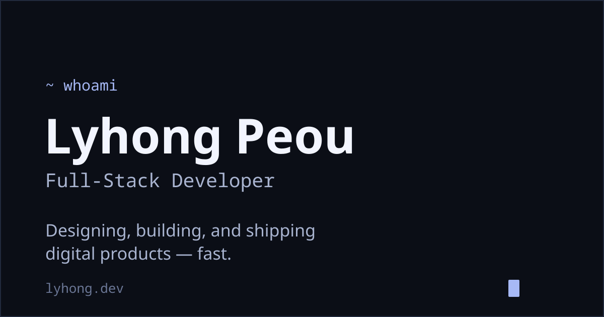

# Lyhong Peou - Developer Portfolio

A minimalist, terminal-inspired portfolio website showcasing my projects and skills as a developer. Built with React, TypeScript, and React Router v7 (prerendered to static HTML), featuring a dark/light mode toggle.



## ✨ Features

- **Refined terminal aesthetic**: Monospace `~ command` prompts mark each section — no window chrome, just clean type and whitespace
- **Static prerendering (SSG)**: Routes prerender to fully-rendered HTML at build time (React Router v7 framework mode), then hydrate on the client — great SEO, hosted as static files
- **Dark/Light mode**: Theme switching via CSS custom properties
- **Project showcase**: Click a project to open a minimal detail panel (Escape to close)
- **Responsive design**: Mobile-first, single centered column
- **Data-driven content**: Update one JSON file to change what's on the page

## 🚀 Live Demo

Visit the live portfolio: [lyhong.dev](https://lyhong.dev)

## 🛠️ Tech Stack

- **Framework**: React 19 + React Router v7 (framework mode, static prerender)
- **Hosting**: Cloudflare Pages (static)
- **Language**: TypeScript
- **Build Tool**: Vite
- **Styling**: CSS with custom properties (OKLCH color space) for theming
- **Fonts**: Inter (sans) + JetBrains Mono (prompts, labels, tags)
- **Icons**: SVGs imported as React components via `vite-plugin-svgr`

## 📁 Project Structure

This is a React Router v7 **framework-mode** app with `appDirectory` set to `src`, so the
framework convention files live in `src/` (there is no `index.html` or `main.tsx`):

```
src/
├── root.tsx                    # Document shell (<html>/<head>/<body>, Meta/Links/Scripts)
├── routes.ts                   # Route config
├── routes/
│   └── home.tsx                # The single page; owns theme state, assembles sections
├── component/
│   ├── Hero.tsx                # "~ whoami" intro
│   ├── Terminal.tsx            # "~ cat about.txt" about section
│   ├── Experience.tsx          # "~ cat experience" work history
│   ├── Recent.tsx              # "~ ls work/" project list + detail modal
│   ├── Contact.tsx             # "~ contact" links + footer
│   └── *.css                   # Co-located component styles
├── assets/
│   ├── data/portfolio.json     # Content: hero, projects, contact
│   └── image/                  # SVG icons
├── App.css                     # Layout, navbar, hero styles
└── index.css                   # CSS variables, theming, fonts, shared classes
```

## 🚀 Getting Started

### Prerequisites
- Node.js (v20 or higher recommended)
- npm

### Installation

```bash
git clone https://github.com/peoul/portfolio_ver_2.git
cd portfolio_ver_2
npm install
```

### Development

```bash
npm run dev        # Dev server with HMR
```

Open `http://localhost:5173`.

### Other commands

```bash
npm run build      # Static build → prerenders routes into build/client/
npm run preview    # Preview the built static site locally
npm run typecheck  # react-router typegen && tsc -b  (run after changing routes)
npm run lint       # eslint
```

### Deploy (Cloudflare Pages)

Static site — connect the repo in Cloudflare Pages with **build command** `npm run build`
and **output directory** `build/client`, or deploy the built folder directly:

```bash
npm run build
npx wrangler pages deploy build/client
```

## 📝 Customization

### Personal Information
Edit `src/assets/data/portfolio.json` to update:
- Personal details (name, title, tagline)
- Project information
- Contact details

> Note: the about facts (education, hobbies, languages) are currently hardcoded in
> `src/component/Terminal.tsx`, not in the JSON.

### Adding Projects
Add new projects to the `projects` array in `portfolio.json`:

```json
{
  "title": "Project Name",
  "description": "Project description with features",
  "tags": ["React", "TypeScript", "CSS"],
  "github": "https://github.com/username/repo"
}
```

### Styling & Theming
- Theme variables and fonts: `src/index.css` (OKLCH custom properties; dark is the
  `:root` default, `[data-theme="light"]` overrides)
- Layout and hero: `src/App.css`
- Component-specific styles: co-located `*.css` files in `src/component/`

The "refined terminal" look uses a monospace `~ command` prompt to head each section.
Keep new sections consistent by reusing the `.prompt` class.

## 📱 Responsive Design

Mobile-first, with a breakpoint at 768px for desktop spacing and type sizes.

## 📧 Contact

- **Email**: lyhongpeou.lp@gmail.com
- **LinkedIn**: [linkedin.com/in/lyhong-peou](https://www.linkedin.com/in/lyhong-peou/)
- **GitHub**: [github.com/peoul](https://github.com/peoul)

## 📄 License

This project is open source and available under the [MIT License](LICENSE).

---

⭐ If you found this portfolio interesting, please consider giving it a star on GitHub!
